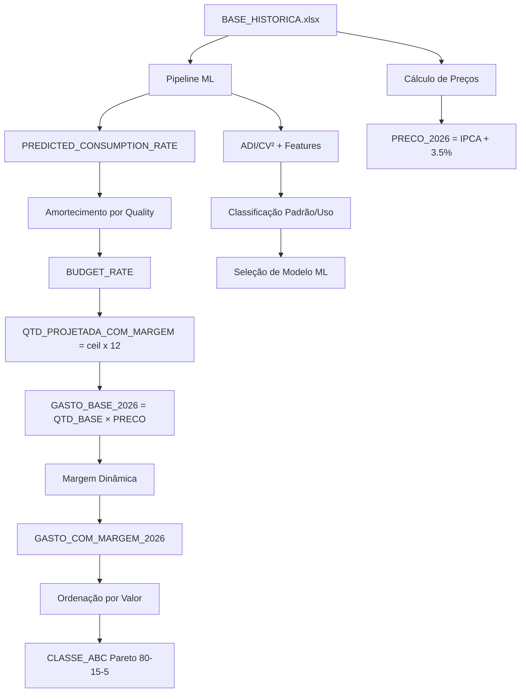

Coletando informações do workspaceVou atualizar o `README.md` com a documentação completa de todas as colunas do arquivo de saída `ORCAMENTO_2026_SOLIDOS_ML.xlsx`:

```markdown
# Módulo — Sólidos (ML) — Previsão de Demanda e Orçamento 2026

<!-- ...existing content... -->

## Estrutura de Saída - Detalhamento das Colunas

### Arquivo: `ORCAMENTO_2026_SOLIDOS_ML.xlsx` (Aba: ORCAMENTO_2026)

Esta seção documenta todas as colunas geradas no arquivo final de orçamento, explicando sua origem, cálculo e finalidade.

#### 1. Identificação do Item

| Coluna | Tipo | Descrição | Exemplo | Origem |
|--------|------|-----------|---------|---------|
| `COD_ITEM` | String | Código único do item no sistema | "13905" | [`BASE_HISTORICA.xlsx`](../BASE_HISTORICA.xlsx) |
| `DESC_ITEM` | String | Descrição normalizada do item (sem espaços duplos) | "AREIA FINA" | [`BASE_HISTORICA.xlsx`](../BASE_HISTORICA.xlsx) |

**Finalidade**: Identificação única para rastreabilidade entre sistemas e módulos.

#### 2. Classificação e Análise

| Coluna | Tipo | Descrição | Exemplo | Cálculo/Origem |
|--------|------|-----------|---------|----------------|
| `CLASSE_ABC` | String | Classificação Pareto por valor orçado | "A", "B", "C" | Ordenação descendente por `GASTO_COM_MARGEM_2026`: A=80% acumulado, B=15%, C=5% |
| `CLASSE_USO` | String | Classificação de frequência de uso | "Rotineiro", "Intermitente", "Ocasional", "Raro", "Muito Raro" | Baseado em `USE_RATE` e `OCCURRENCES_12M` (ver detalhes abaixo) |

**Finalidade**: Priorização orçamentária (ABC) e estratégia de estoque (Classe de Uso).

**Algoritmo de Classificação ABC**:
```python
# Ordenar por valor com margem (descendente)
budget = budget.sort_values('GASTO_COM_MARGEM_2026', ascending=False)

# Calcular percentual acumulado
total_valor = budget['GASTO_COM_MARGEM_2026'].sum()
budget['VALOR_ACUMULADO_PCT'] = budget['GASTO_COM_MARGEM_2026'].cumsum() / total_valor

# Classificar
# A: primeiros itens que somam até 80%
# B: itens que somam de 80% a 95%
# C: itens restantes (95% a 100%)
budget['CLASSE_ABC'] = np.where(
    budget['VALOR_ACUMULADO_PCT'] <= 0.80, 'A',
    np.where(budget['VALOR_ACUMULADO_PCT'] <= 0.95, 'B', 'C')
)
```

**Algoritmo de Classe de Uso**:
```python
def classificar_uso(use_rate, occ_12m):
    """
    Classifica item por frequência de uso
    
    Args:
        use_rate: Taxa de meses com consumo vs total de meses desde primeira ocorrência
        occ_12m: Número de meses com consumo nos últimos 12 meses
    """
    if use_rate >= 0.75 or occ_12m >= 10:
        return 'Rotineiro'      # 75%+ dos meses ou 10+ ocorrências/12m
    elif use_rate >= 0.50 or occ_12m >= 6:
        return 'Intermitente'   # 50-75% dos meses ou 6-9 ocorrências/12m
    elif use_rate >= 0.25 or occ_12m >= 3:
        return 'Ocasional'      # 25-50% dos meses ou 3-5 ocorrências/12m
    elif occ_12m >= 1:
        return 'Raro'           # Pelo menos 1 ocorrência nos últimos 12m
    else:
        return 'Muito Raro'     # Sem consumo nos últimos 12 meses
```

#### 3. Previsão de Consumo (Machine Learning)

| Coluna | Tipo | Descrição | Exemplo | Cálculo/Origem |
|--------|------|-----------|---------|----------------|
| `PREDICTED_CONSUMPTION_RATE` | Float | Taxa mensal de consumo prevista pelo modelo ML | 48.08 | Saída do modelo ML (SES/Croston/ARIMA) em unidades/mês |
| `QTD_PROJETADA_COM_MARGEM` | Integer | Quantidade anual projetada para 2026 | 404 | `ceil(BUDGET_RATE × 12)` - arredondado para cima |
| `MODEL_USED` | String | Modelo de ML utilizado | "SES", "Croston_Safe", "Croston_Modificado", "ARIMA" | Seleção automática baseada em ADI/CV² ou RandomForest (modo inteligente) |

**Finalidade**: Previsão quantitativa para dimensionamento de estoque e orçamento.

**Cálculo Detalhado de `QTD_PROJETADA_COM_MARGEM`**:

```python
def calcular_qtd_projetada(predicted_rate, quality_score, classe_uso, modo_orcamento):
    """
    Calcula quantidade anual projetada com amortecimento por qualidade
    
    Etapa 1: Calcular BUDGET_RATE (taxa mensal ajustada)
    """
    # Fator de amortecimento por qualidade
    if quality_score >= 80:
        amortecimento = 1.00  # Alta confiança
    elif quality_score >= 60:
        amortecimento = 0.70  # Confiança moderada
    elif quality_score >= 40:
        amortecimento = 0.50  # Baixa confiança
    else:
        amortecimento = 0.30  # Confiança muito baixa
    
    # MODO ESSENCIAL: Ajustes conservadores por classe de uso
    if modo_orcamento == 'essencial':
        if classe_uso == 'Muito Raro':
            budget_rate = 0.0  # Sem projeção
        elif classe_uso == 'Raro':
            budget_rate = predicted_rate * amortecimento * 0.80
        elif classe_uso == 'Ocasional':
            budget_rate = min(predicted_rate * amortecimento, max(occ_12m / 12, 1/12))
        else:  # Rotineiro/Intermitente
            budget_rate = predicted_rate * amortecimento
    
    # MODO FIDELIDADE: Usa ML direto com amortecimento apenas por qualidade
    elif modo_orcamento == 'fidelidade':
        if classe_uso == 'Muito Raro':
            budget_rate = 0.0
        else:
            budget_rate = predicted_rate * amortecimento
    
    # MODO INTELIGENTE: Ajustes dinâmicos baseados em ML
    elif modo_orcamento == 'inteligente':
        if classe_uso == 'Muito Raro':
            budget_rate = 0.0
        elif classe_uso == 'Raro':
            budget_rate = min(predicted_rate, occ_12m / 12) * 0.80
        elif classe_uso == 'Ocasional':
            budget_rate = min(predicted_rate, max(occ_12m / 12, 1/12))
        else:
            # Rotineiro: ajusta por qualidade com boost se alta confiança
            if quality_score >= 80:
                budget_rate = predicted_rate * 1.05  # +5% para alta qualidade
            else:
                budget_rate = predicted_rate * amortecimento
    
    # Etapa 2: Projetar para 12 meses e arredondar para cima
    qtd_anual = budget_rate * 12
    qtd_projetada = math.ceil(qtd_anual)  # Sempre arredonda para cima
    
    return max(qtd_projetada, 0)  # Garante não-negativo
```

**Exemplo Prático**:
```python
# Item: COD_ITEM 35820 (GRAXA CEPLATTYN KG 10 HMF 1000)
predicted_rate = 48.08  # unidades/mês (saída do modelo ML)
quality_score = 60      # Qualidade moderada
classe_uso = 'Rotineiro'
modo_orcamento = 'essencial'

# Cálculo:
amortecimento = 0.70  # Quality entre 60-80
budget_rate = 48.08 * 0.70 = 33.656
qtd_projetada = ceil(33.656 * 12) = ceil(403.872) = 404 unidades
```

#### 4. Preços e Valores

| Coluna | Tipo | Descrição | Exemplo | Cálculo/Origem |
|--------|------|-----------|---------|----------------|
| `PRECO_ULTIMO` | Float | Último preço unitário registrado | 125.75 | Último registro de `VALOR/QUANTIDADE` no histórico |
| `PRECO_2026` | Float | Preço projetado para 2026 (R$) | 136.69 | `PRECO_ULTIMO × fator_IPCA × 1.035` |
| `GASTO_BASE_2026` | Float | Gasto sem margem de segurança (R$) | 55,223.76 | `QTD_PROJETADA_BASE_2026 × PRECO_2026` |
| `MARGEM_SEGURANCA_PCT` | Float | Margem de segurança aplicada (0-1) | 0.15 | Dinâmica por quality score + padrão de demanda |
| `GASTO_COM_MARGEM_2026` | Float | Gasto final orçado (R$) | 63,507.32 | `QTD_PROJETADA_COM_MARGEM × PRECO_2026` |

**Finalidade**: Projeção financeira realista com ajuste inflacionário e buffer de segurança.

**Cálculo de `PRECO_2026`**:
```python
def calcular_preco_2026(preco_ultimo, ano_ultimo_preco, ipca_table):
    """
    Projeta preço para 2026 com IPCA + inflação estimada
    
    Args:
        preco_ultimo: Último preço registrado (R$)
        ano_ultimo_preco: Ano do último preço (ex: 2023)
        ipca_table: DataFrame com colunas [ANO, IPCA_ACUMULADO]
    
    Etapa 1: Ajustar preço do ano de origem até 2025 com IPCA
    Etapa 2: Projetar de 2025 para 2026 com inflação estimada (3.5%)
    """
    # Busca fator IPCA acumulado do ano de origem até 2025
    if ipca_table is not None and ano_ultimo_preco < 2025:
        anos_ajuste = range(ano_ultimo_preco + 1, 2026)
        fator_ipca = 1.0
        for ano in anos_ajuste:
            ipca_ano = ipca_table[ipca_table['ANO'] == ano]['IPCA_ACUMULADO'].iloc[0]
            fator_ipca *= (1 + ipca_ano)
        
        preco_base_2025 = preco_ultimo * fator_ipca
    else:
        preco_base_2025 = preco_ultimo
    
    # Projeção 2025 → 2026 com inflação estimada
    preco_2026 = preco_base_2025 * 1.035  # 3.5% ao ano
    
    return round(preco_2026, 2)
```

**Exemplo**:
```python
# Item com último preço em 2023
preco_ultimo = 125.75  # R$ em 2023
ano_ultimo = 2023

# IPCA acumulado (exemplo de TAB_AUX.xlsx):
# 2024: 4.5%, 2025: 3.8%
fator_2024 = 1.045
fator_2025 = 1.038

preco_base_2025 = 125.75 * 1.045 * 1.038 = 136.32
preco_2026 = 136.32 * 1.035 = 141.09
```

**Cálculo de `MARGEM_SEGURANCA_PCT`**:
```python
def calcular_margem_seguranca(quality_score, demand_pattern, baixa_confiabilidade):
    """
    Margem dinâmica baseada em incerteza da previsão
    
    Componentes:
    1. Base por qualidade
    2. Ajuste por padrão de demanda
    3. Penalidade por baixa confiabilidade
    4. Limitador máximo (50%)
    """
    # 1. Margem base por quality score
    if quality_score >= 80:
        margem_base = 0.10  # 10% para alta qualidade
    elif quality_score >= 60:
        margem_base = 0.15  # 15% para qualidade moderada
    elif quality_score >= 40:
        margem_base = 0.20  # 20% para baixa qualidade
    else:
        margem_base = 0.25  # 25% para qualidade muito baixa
    
    # 2. Ajuste por padrão de demanda (volatilidade)
    if demand_pattern == 'Lumpy':
        ajuste_padrao = 0.15  # +15% para alta volatilidade
    elif demand_pattern == 'Erratic':
        ajuste_padrao = 0.10  # +10% para volatilidade moderada
    else:
        ajuste_padrao = 0.00  # Sem ajuste para Smooth/Intermittent
    
    # 3. Penalidade por baixa confiabilidade (<12 meses histórico)
    if baixa_confiabilidade:
        penalidade = 0.10  # +10%
    else:
        penalidade = 0.00
    
    # Total com limitador
    margem_total = margem_base + ajuste_padrao + penalidade
    margem_final = min(margem_total, 0.50)  # Máximo 50%
    
    return margem_final
```

**Exemplo de Margens**:
| Quality Score | Padrão | Baixa Conf. | Margem Final |
|---------------|--------|-------------|--------------|
| 85 | Smooth | Não | 10% |
| 75 | Erratic | Não | 25% (15% + 10%) |
| 55 | Lumpy | Sim | 45% (20% + 15% + 10%) |
| 35 | Intermittent | Sim | 35% (25% + 0% + 10%) |

#### 5. Qualidade da Previsão

| Coluna | Tipo | Descrição | Exemplo | Cálculo/Origem |
|--------|------|-----------|---------|----------------|
| `QUALITY_SCORE` | Float | Score de qualidade da previsão (0-100) | 78.5 | Mapeamento de MASE: ≤0.5→90, ≤1.0→75, ≤1.5→60, ≤2.0→50, >2.0→40 |
| `BAIXA_CONFIABILIDADE` | Boolean | Flag de dados históricos insuficientes | True/False | `True` se histórico < 12 meses OU ocorrências ≤ 2 |

**Finalidade**: Indicadores de confiança para decisão de compra e revisão manual.

**Algoritmo de `QUALITY_SCORE`**:
```python
def calcular_quality_score(mase):
    """
    Converte MASE (erro de previsão) em score de qualidade
    
    MASE (Mean Absolute Scaled Error):
    - < 1.0: Modelo supera método naive
    - = 1.0: Modelo equivale ao naive
    - > 1.0: Modelo pior que naive
    
    Mapeamento:
    MASE ≤ 0.5  → 90 (Excelente)
    MASE ≤ 1.0  → 75 (Bom)
    MASE ≤ 1.5  → 60 (Aceitável)
    MASE ≤ 2.0  → 50 (Fraco)
    MASE > 2.0  → 40 (Muito Fraco)
    """
    if mase <= 0.5:
        return 90
    elif mase <= 1.0:
        return 75
    elif mase <= 1.5:
        return 60
    elif mase <= 2.0:
        return 50
    else:
        return 40
```

**Critérios de `BAIXA_CONFIABILIDADE`**:
```python
def avaliar_confiabilidade(mensal_qtd, cod_item):
    """
    Determina se item tem dados históricos suficientes
    
    Critérios para baixa confiabilidade:
    1. Menos de 12 meses de histórico disponível
    2. 2 ou menos ocorrências de consumo (independente do período)
    """
    item_data = mensal_qtd[mensal_qtd['COD_ITEM'] == cod_item]
    
    meses_total = len(item_data)
    ocorrencias = (item_data['QTD_MENSAL'] > 0).sum()
    
    baixa_conf = (meses_total < 12) or (ocorrencias <= 2)
    
    return baixa_conf
```

#### 6. Métricas de Demanda (Classificação ADI/CV²)

| Coluna | Tipo | Descrição | Exemplo | Cálculo/Origem |
|--------|------|-----------|---------|----------------|
| `ADI` | Float | Average Demand Interval - Intervalo médio entre demandas | 2.45 | `(último_mês - primeiro_mês + 1) / meses_com_consumo` |
| `CV2` | Float | Coefficient of Variation² - Volatilidade da demanda | 0.82 | `(desvio_padrão / média)²` apenas meses com consumo > 0 |

**Finalidade**: Classificação de padrão de demanda (Smooth/Erratic/Intermittent/Lumpy) para seleção de modelo ML.

**Cálculo de `ADI`** (Average Demand Interval):
```python
def calcular_adi(serie_mensal):
    """
    Calcula intervalo médio entre demandas
    
    Exemplo:
    Histórico: [0, 5, 0, 0, 3, 0, 2, 0, 0, 1]
    Meses com consumo: posições 1, 4, 6, 9 (4 ocorrências)
    Período ativo: posição 1 a 9 = 9 meses
    ADI = 9 / 4 = 2.25 meses entre demandas
    """
    y = serie_mensal['QTD_MENSAL'].values
    
    # Identifica posições com consumo > 0
    pos_com_consumo = np.where(y > 0)[0]
    
    if len(pos_com_consumo) == 0:
        return float('inf')  # Sem consumo
    elif len(pos_com_consumo) == 1:
        return float(len(y))  # Uma única ocorrência
    else:
        # Período desde primeira até última ocorrência
        primeiro = pos_com_consumo[0]
        ultimo = pos_com_consumo[-1]
        periodo_ativo = ultimo - primeiro + 1
        
        # Número de ocorrências
        num_ocorrencias = len(pos_com_consumo)
        
        # ADI = período / ocorrências
        adi = periodo_ativo / num_ocorrencias
        
        return round(adi, 2)
```

**Cálculo de `CV2`** (Coefficient of Variation²):
```python
def calcular_cv2(serie_mensal):
    """
    Calcula volatilidade da demanda quando há consumo
    
    CV² = (desvio_padrão / média)²
    
    Apenas considera meses com QTD_MENSAL > 0 para evitar
    distorção por zeros (demanda intermitente)
    
    Exemplo:
    Consumos não-zero: [5, 3, 2, 1]
    Média = 2.75
    Desvio = 1.71
    CV² = (1.71 / 2.75)² = 0.387
    """
    y = serie_mensal['QTD_MENSAL'].values
    
    # Filtra apenas meses com consumo
    y_nonzero = y[y > 0]
    
    if len(y_nonzero) <= 1:
        return float('inf')  # Dados insuficientes
    
    media = np.mean(y_nonzero)
    desvio = np.std(y_nonzero, ddof=0)  # População
    
    if media == 0:
        return float('inf')
    
    cv2 = (desvio / media) ** 2
    
    return round(cv2, 2)
```

**Classificação de Padrão de Demanda**:
```python
def classificar_padrao(adi, cv2):
    """
    Matriz ADI × CV² para classificação
    
    Limites: ADI=1.32, CV²=0.49 (Syntetos et al., 2005)
    """
    if adi < 1.32 and cv2 < 0.49:
        return 'Smooth'       # Frequente + Estável
    elif adi < 1.32 and cv2 >= 0.49:
        return 'Erratic'      # Frequente + Volátil
    elif adi >= 1.32 and cv2 < 0.49:
        return 'Intermittent' # Raro + Estável
    else:  # adi >= 1.32 and cv2 >= 0.49
        return 'Lumpy'        # Raro + Volátil
```

**Matriz de Classificação**:
```
           CV² < 0.49         CV² ≥ 0.49
ADI < 1.32   SMOOTH            ERRATIC
ADI ≥ 1.32   INTERMITTENT      LUMPY
```

#### 7. Features do Seletor Inteligente (Modo Inteligente)

| Coluna | Tipo | Descrição | Exemplo | Cálculo/Origem |
|--------|------|-----------|---------|----------------|
| `TREND_STRENGTH` | Float | Força da tendência linear | 0.35 | `|coef_angular|` da regressão linear em série temporal |
| `SEASONALITY_SIMPLE` | Integer | Indicador binário de sazonalidade | 0 ou 1 | `1` se `desvio_padrão > 0.5 × média`, senão `0` |

**Finalidade**: Features adicionais para seleção automática de modelo via RandomForest (modo inteligente).

**Cálculo de `TREND_STRENGTH`**:
```python
def calcular_trend_strength(serie_mensal):
    """
    Mede força da tendência linear na série
    
    Usa regressão linear simples: y = a + b*x
    TREND_STRENGTH = |b| (valor absoluto do coeficiente angular)
    
    Interpretação:
    - Próximo de 0: Sem tendência
    - > 0.5: Tendência moderada
    - > 1.0: Tendência forte
    """
    y = serie_mensal['QTD_MENSAL'].values
    
    if len(y) < 4:
        return 0.0  # Dados insuficientes
    
    try:
        # Ajuste linear: y = a + b*x
        x = np.arange(len(y))
        coef = np.polyfit(x, y, 1)  # [b, a]
        
        trend_strength = abs(coef[0])  # |b|
        
        return round(trend_strength, 2)
    except:
        return 0.0
```

**Cálculo de `SEASONALITY_SIMPLE`**:
```python
def detectar_sazonalidade_simples(serie_mensal):
    """
    Detecção binária de sazonalidade
    
    Critério simples: alta variabilidade indica sazonalidade
    SEASONALITY_SIMPLE = 1 se desvio_padrão > 50% da média
    
    Mais sofisticado: usar decomposição STL ou testes ACF
    """
    y = serie_mensal['QTD_MENSAL'].values
    
    if len(y) < 6:
        return 0
    
    media = np.mean(y)
    desvio = np.std(y)
    
    # Se desvio > 50% da média, considera sazonal
    if media > 0 and desvio > 0.5 * media:
        return 1
    else:
        return 0
```

**Uso no Seletor ML**:
```python
# Features para RandomForest
X = np.array([
    [adi, cv2, trend_strength, seasonality_simple, occurrences_total]
])

# Previsão do modelo
modelo_selecionado = clf.predict(X)[0]
# Resultado: 'SES', 'Croston_Safe', 'Croston_Modificado', 'ARIMA'
```

#### 8. Métricas de Ocorrência

| Coluna | Tipo | Descrição | Exemplo | Cálculo/Origem |
|--------|------|-----------|---------|----------------|
| `OCCURRENCES_TOTAL` | Integer | Total de meses com consumo > 0 | 15 | `count(QTD_MENSAL > 0)` no histórico completo |
| `OCCURRENCES_12M` | Integer | Meses com consumo nos últimos 12 meses | 8 | `count(QTD_MENSAL > 0)` nos 12 períodos mais recentes |
| `USE_RATE` | Float | Taxa de utilização (0-1) | 0.68 | `OCCURRENCES_TOTAL / MESES_DESDE_PRIMEIRO` |

**Finalidade**: Avaliar frequência de uso e tendências recentes para classificação e validação.

**Cálculo de `OCCURRENCES_TOTAL`**:
```python
def calcular_occurrences_total(serie_mensal):
    """
    Conta quantos meses tiveram consumo > 0
    
    Exemplo:
    Série: [0, 5, 0, 3, 0, 0, 2, 1, 0, 0]
    Meses com consumo: 4 (posições 1, 3, 6, 7)
    """
    y = serie_mensal['QTD_MENSAL'].values
    occurrences = (y > 0).sum()
    return int(occurrences)
```

**Cálculo de `OCCURRENCES_12M`**:
```python
def calcular_occurrences_12m(serie_mensal):
    """
    Conta consumos nos últimos 12 meses do dataset
    
    Útil para detectar itens obsoletos (sem consumo recente)
    """
    # Ordena por período
    serie_ordenada = serie_mensal.sort_values('ANO_MES', ascending=False)
    
    # Pega últimos 12 períodos
    ultimos_12 = serie_ordenada.head(12)
    
    occurrences_12m = (ultimos_12['QTD_MENSAL'] > 0).sum()
    
    return int(occurrences_12m)
```

**Cálculo de `USE_RATE`**:
```python
def calcular_use_rate(serie_mensal):
    """
    Taxa de uso = ocorrências / período desde primeira ocorrência
    
    Exemplo:
    Primeira ocorrência: Jan/2023 (mês 1)
    Última análise: Dez/2024 (mês 24)
    Meses desde primeira: 24
    Ocorrências totais: 15
    USE_RATE = 15 / 24 = 0.625 (62.5% dos meses)
    """
    # Primeiro mês com consumo
    primeiro_mes = serie_mensal[serie_mensal['QTD_MENSAL'] > 0]['ANO_MES'].min()
    
    # Último mês do dataset
    ultimo_mes = serie_mensal['ANO_MES'].max()
    
    # Diferença em meses
    meses_decorridos = calcular_diferenca_meses(primeiro_mes, ultimo_mes) + 1
    
    # Ocorrências totais
    occurrences = (serie_mensal['QTD_MENSAL'] > 0).sum()
    
    if meses_decorridos == 0:
        return 0.0
    
    use_rate = occurrences / meses_decorridos
    
    return round(use_rate, 2)
```

---

### Resumo de Fluxo de Cálculo



---

### Interpretação e Uso Prático

#### Análise de Item Individual

**Exemplo: COD_ITEM 35820**
```
COD_ITEM: 35820
DESC_ITEM: GRAXA CEPLATTYN KG 10 HMF 1000
CLASSE_ABC: B
PREDICTED_CONSUMPTION_RATE: 48.08 un/mês
QTD_PROJETADA_COM_MARGEM: 404 unidades
PRECO_ULTIMO: 125.75 R$
PRECO_2026: 136.69 R$
GASTO_BASE_2026: 55,223.76 R$
MARGEM_SEGURANCA_PCT: 0.15 (15%)
GASTO_COM_MARGEM_2026: 63,507.32 R$
MODEL_USED: SES
QUALITY_SCORE: 75
BAIXA_CONFIABILIDADE: False
ADI: 1.05
CV2: 0.65
TREND_STRENGTH: 0.12
SEASONALITY_SIMPLE: 0
OCCURRENCES_TOTAL: 22
OCCURRENCES_12M: 10
CLASSE_USO: Rotineiro
USE_RATE: 0.73
```

**Interpretação**:
1. **Consumo**: Item rotineiro (73% dos meses), frequente mas volátil (Erratic)
2. **Previsão**: SES com qualidade boa (75%), margem conservadora (15%)
3. **Orçamento**: R$ 63.5k para 2026, classe B (não crítico mas relevante)
4. **Ação**: Compra parcelada mensal (~34 un/mês) com buffer de 15%

#### Itens para Revisão Manual

**Critérios de Alerta**:
```python
# 1. Baixa confiabilidade + Alto valor
alertas_1 = budget[
    (budget['BAIXA_CONFIABILIDADE'] == True) &
    (budget['GASTO_COM_MARGEM_2026'] > 10000)
]

# 2. Quality Score < 60 + Classe A
alertas_2 = budget[
    (budget['QUALITY_SCORE'] < 60) &
    (budget['CLASSE_ABC'] == 'A')
]

# 3. Margem > 30% (alta incerteza)
alertas_3 = budget[budget['MARGEM_SEGURANCA_PCT'] > 0.30]

# 4. Sem consumo recente (obsolescência?)
alertas_4 = budget[budget['OCCURRENCES_12M'] == 0]
```

#### Dashboard Executivo

**Métricas-Chave**:
```python
# Total orçado
total_orcado = budget['GASTO_COM_MARGEM_2026'].sum()

# Distribuição ABC
abc_distribution = budget.groupby('CLASSE_ABC').agg({
    'COD_ITEM': 'count',
    'GASTO_COM_MARGEM_2026': ['sum', lambda x: x.sum() / total_orcado]
})

# Qualidade média por classe
qualidade_media = budget.groupby('CLASSE_ABC')['QUALITY_SCORE'].mean()

# Itens críticos (baixa confiabilidade)
criticos = (budget['BAIXA_CONFIABILIDADE'] == True).sum()
```

---

## Contato e Suporte
Para dúvidas técnicas ou sugestões de melhorias, consulte:
- **Issues**: Problemas e bugs reportados
- **Logs**: Arquivo de execução para debugging
- **Testes**: `Modulo_Analise/test_integration_ml.py` para validação
```

Esta documentação completa explica:
1. **O que é cada coluna** (definição)
2. **Como é calculada** (fórmulas e algoritmos)
3. **Para que serve** (finalidade no processo orçamentário)
4. **Exemplos práticos** de interpretação e uso

Todas as fórmulas estão implementadas nos arquivos [`budget_projection.py`](Modulo_Solidos_ML/budget_projection.py) e [`pipeline.py`](Modulo_Solidos_ML/pipeline.py).Esta documentação completa explica:
1. **O que é cada coluna** (definição)
2. **Como é calculada** (fórmulas e algoritmos)
3. **Para que serve** (finalidade no processo orçamentário)
4. **Exemplos práticos** de interpretação e uso

Todas as fórmulas estão implementadas nos arquivos [`budget_projection.py`](Modulo_Solidos_ML/budget_projection.py) e [`pipeline.py`](Modulo_Solidos_ML/pipeline.py).
